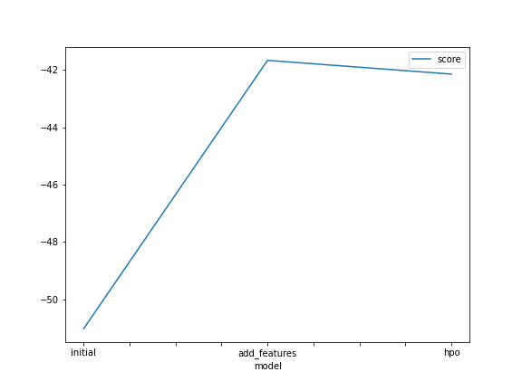
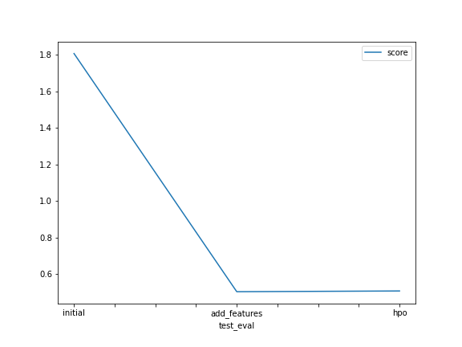

# Report: Predict Bike Sharing Demand with AutoGluon Solution
#### Keith WU

## Initial Training
### What did you realize when you tried to submit your predictions? What changes were needed to the output of the predictor to submit your results?

1. All negative values should be set to zero;
2. All float predictions should be round to integers.

### What was the top ranked model that performed?

WeightedEnsemble_L3.

## Exploratory data analysis and feature creation
### What did the exploratory analysis find and how did you add additional features?

**EDA** :

1.  People are more likely to use bike sharing increases year by year;
2.  People are less likely to use bike in winter;
3. Working days and weekends have totaly diiffenent demand patterns;
4. People more likely to use bike in hot weather;
5. People more likely to use bike in mild humidity;
6. There are no extreme outliers of demand; but there are extreme outliers of windspeed.

**Feature Engineering** :

1. Add more time features such as year, month, hour;
2. season variable is highly correlated with month; working day is highly correlated with day of week. Drop one of them;
3. Temperature variable shares 97% correlation with feel-like temperature. I drop the latter since 'feel-like' means more bias;
4. Encode temperature, windspeed, humidity as categorical variables.

### How much better did your model preform after adding additional features and why do you think that is?

It results in a huge improvement from kaggle score from 1.80656 to 0.50239, though the best model is the same.

## Hyper parameter tuning
### How much better did your model preform after trying different hyper parameters?

Acutally, the performance drops a little bit from 0.50239 to 0.50650. It is possible we did not find the optimal parameters and model combination due to limited time constrain.

### If you were given more time with this dataset, where do you think you would spend more time?

I will dig deeper into feature engineering and spend more time in hyperparameter tuning.

### Create a table with the models you ran, the hyperparameters modified, and the kaggle score.

|model|hpo1|hpo2|hpo3|score|
|--|--|--|--|--|
|initial|default|default|default|1.80656|
|add_features|default|default|default|0.50239|
|hpo|CAT: {'iterations': 10000}]|RF: {'n_estimators': 300}|XT: {'n_estimators': 300}|0.50650|

### Create a line plot showing the top model score for the three (or more) training runs during the project.

****
### Create a line plot showing the top kaggle score for the three (or more) prediction submissions during the project.

## Summary
Predicting bike sharing demand not only helps businesses prepare for spikes in their services but also improves customer experience by limiting delays.

In this project, I use the AutoGluon library to train several models for the Bike Sharing Demand competition in Kaggle. Although further hyperparameter does not imporve the score a lot, a best weighted ensemble model achieves 0.50239 in kaggle.

More features and longer hyper parameter tuning time are expected to further imporve the model.
